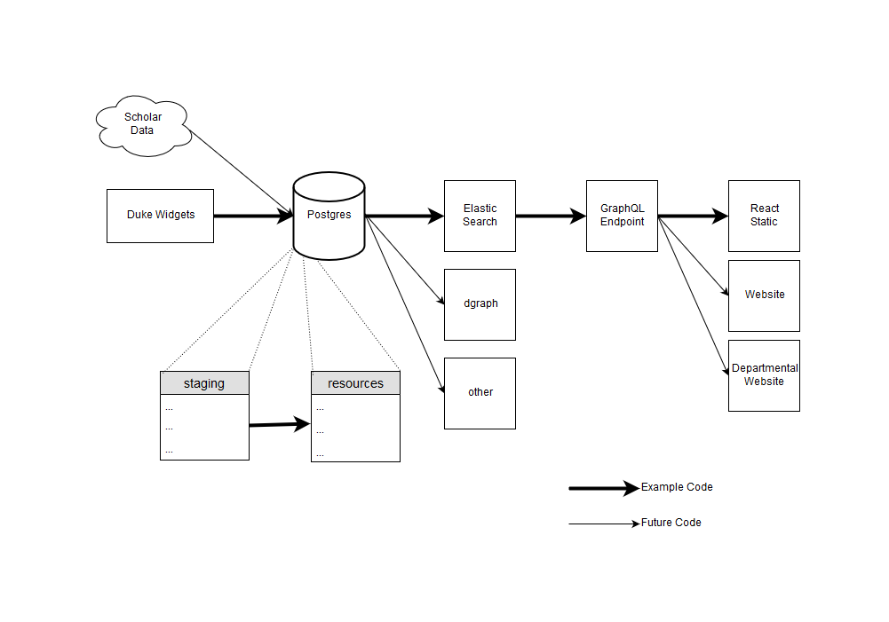

# Product Evolution

Here is a diagram to capture the flow of data loading into an Elastic Search
index for dissemination by a GraphQL endpoint. This is an experiment and will
change going forward in the future.



Imports vivo_widgets data into an Elastic instance

# Requirements

This needs go >= 1.11.1 - because it uses the new 'mod' stuff

I've installed that locally with asdf, then set local GOPATH with direnv
but eventually this will be dockerized

# Setup

Requires a bit (now):

## postgresql
Running instance of postgresql with credentials that are
read from a './config.toml' file (see config.toml.example):

## elastic
Running instance of elasticsearch
* localhost:9200

NOTE: these can both be started via docker-compose

> docker-compose up

or if one or other is already install locally

> docker-compose up <service_to_start>

## Importers (e.g. Go Code)

### Building

> ./build.sh

### Running

Example: run them in order

#### 1

Import data from a specified duke widget organization URI into a `staging` table

> cmd/widgets_import/widgets_import -config <config_file> -org org50000500 -type all

#### 2

Import data from staging table into `resources` table

> cmd/staging_import/staging_import -config <config_file> -type all


#### 3

Import data from `resources` table into elastic index

> cmd/elastic_import/elastic_import -config <config_file> -type all


**NOTE**: to reset data, run the same commands with the `-remove` flag set e.g.:

> cmd/elastic_import/elastic_import -remove=true -type all
> cmd/elastic_import/elastic_import -type=people -remove=true


### Config

If you have `export ENVIRONMENT=development` it will look for a config.toml file
in the current directory.  You can also set another path to find the file 
with `export CONFIG_PATH=<some_dir>`

If not development, it will look for ENVIRONMENT variables e.g.:

```bash

export DATABASE_SERVER="localhost"
export DATABASE_PORT="5432"
export DATABASE_DATABASE="vivo_data"
export DATABASE_USER="vivo_data"
export DATABASE_PASSWORD="vivo_data"
export ELASTIC_URL="http://localhost:9200"

```

### Elastic caveats

It is possible that elastic_import may only work inside of the Docker instance. In which case you would do the following:

> cd produce-evolution-sandbox/experiments/duke/elastic_import
> docker-compose run --rm importer sh
> bash
> ./build.sh
> ./cmd/elastic_import/elastic_import -type all

If localhost:9200 does not display the Elasticsearch instance in your browser, you may be running
Mac or Windows, and have the docker ip mapped to an alias for convenience (such as `docker`).
So try docker:9200 instead (for instance).


### Getting started

You can run each `type` separately.  Typically, for demo purposes you would just
run `-type all`, but the option is there to run (and remove) by type:

#### People
> cmd/widgets_import/widgets_import -type=people
> cmd/staging_import/staging_import -type=people
> cmd/elastic_import/elastic_import -type=people

#### Affiliations (**NOTE:*** 'positions' vs 'affiliations')
> cmd/widgets_import/widgets_import -type=positions
> cmd/staging_import/staging_import -type=affiliations
> cmd/elastic_import/elastic_import -type=affiliations

#### Educations
> cmd/widgets_import/widgets_import -type=educations
> cmd/staging_import/staging_import -type=educations
> cmd/elastic_import/elastic_import -type=educations

#### Grants
> cmd/widgets_import/widgets_import -type=grants
> cmd/staging_import/staging_import -type=grants
> cmd/elastic_import/elastic_import -type=grants

#### Publications
> cmd/widgets_import/widgets_import -type=publications
> cmd/staging_import/staging_import -type=publications
> cmd/elastic_import/elastic_import -type=publications


## Exporting data from Elasticsearch
> npm install elasticdump

***NOTE:*** in these examples `docker` is whatever you have aliased the docker IP to:

### Backup index map to a file:
> ./bin/elasticdump \
  --input=http://docker:9200/people \
  --output=people_index_mapping.json \
  --type=mapping

### Backup index data to a file:
> ./bin/elasticdump \
  --input=http://docker:9200/people \
  --output=people_index_data.json \
  --type=data

For additional elasticdump commands and options, see: https://hub.docker.com/r/taskrabbit/elasticsearch-dump/

## Elastic Mappings

If you want to use the graphql_endpoint and react-static parts of this duke/experiment
folder without using this particular, duke-specific data ingest method, you only need
to bring in data however it is easiest for you in the following elastic mappings:


### personMapping

```json
"person":{
	"properties":{
		"id":           { "type": "text" },
		"uri":          { "type": "text" },
		"primaryTitle": { "type": "text" },
		"name":{
			"type":"object",
			"properties": {
				"firstName":  { "type": "text" },
				"lastName":   { "type": "text" },
				"middleName": { "type": "text" }
		    }
		},
		"image": {
			"type": "object",
			"properties": {
				"main":      { "type": "text" },
				"thumbnail": { "type": "text" }
			}
		},
	        "keywordList": {
	          "type": "nested",
	          "properties": {
		      "uri":   { "type": "text" },
		      "label": { "type": "text" }
	          }
		},
		"affiliationList": {
			"type": "nested",
		        "properties":{
		          "id":        { "type": "text" },
		          "uri":       { "type": "text" },
		          "label":     { "type": "text" },
		          "startDate": {
			      "type": "object",
			      "properties": {
				    "dateTime":   { "type": "text" },
				    "resolution": { "type": "text" }
			      }
		          },
		          "organizationId":    { "type": "text" },
		          "organizationLabel": { "type": "text" } 
                     }
		},
		"educationList": {
			"type": "nested",
	                "properties":{
		          "id":        { "type": "text" },
		          "uri":       { "type": "text" },
		          "label":     { "type": "text" },
		          "personId":  { "type": "text" },
		          "org":     { 
			        "type": "object",
			        "properties": {
				      "id": { "type": "text" },
				      "label": { "type": "text" }
			        }
		        }
	            }
		},
		"extensions": {
			"type": "nested",
			"properties": {
				"key":   { "type": "text" },
				"value": { "type": "text" }
			}			
		}
    }
}
```

### grants

```json
"grant":{
	"properties":{
		"id":        { "type": "text" },
		"uri":       { "type": "text" },
		"label":     { "type": "text" },
		"startDate": {
			"type": "object",
			"properties": {
				"dateTime":   { "type": "text" },
				"resolution": { "type": "text" }
			}
		},
		"endDate": {
			"type": "object",
			"properties": {
				"dateTime":   { "type": "text" },
				"resolution": { "type": "text" }
			}
		}
	}
}
```

### funding-roles

```json
"funding-role":{
	"properties":{
		"id":        { "type": "text" },
		"uri":       { "type": "text" },
		"grantId":   { "type": "text" },
		"personId":  { "type": "text" },
		"label":     { "type": "text" }
	}
}
```

### publications

```json
"publication":{
	"properties":{
		"id":         { "type": "text" },
		"uri":        { "type": "text" },
		"label":      { "type": "text" },
		"authorList": { "type": "text" },
		"doi":        { "type": "text" },
        "venue":      {
			"type": "object",
			"properties": {
				"uri":   { "type": "text" },
				"label": { "type": "text" }
			}
		}
	}
}
```

### authorships

```json
"authorship":{
	"properties":{
		"id":             { "type": "text" },
		"uri":            { "type": "text" },
		"publicationId":  { "type": "text" },
		"personId":       { "type": "text" },
		"label":          { "type": "text" }
	}
}
```

You can also *only* bring in data to the staging table (see cmd/staging_import/main.go).

